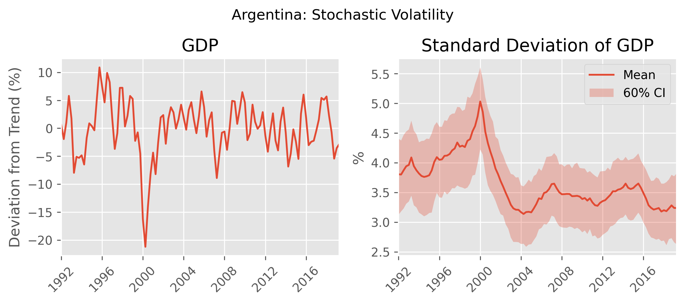

# Stochastic Volatility


### Task
- Economies frequently experience large downturn beyond the scope of a 'normal' downturn.
- This project considers that the average size of a downturn can vary over time. 
- I estimate this using the model

```math
\begin{align}
\underbrace{\log y_t}_{\text{Observed}} &= \rho_y \log y_{t-1} + \exp(\sigma_{t-1}) \epsilon_t \\
\underbrace{\sigma_t}_{\text{Unobserved}} &= (1-\rho_\sigma) \overline{\sigma} + \rho_{\sigma} \sigma_{t-1} + \sigma_\nu \nu_t \\
\epsilon_t &\sim \mathcal{N}(0, 1) \\
\nu_t &\sim \mathcal{N}(0, 1).
\end{align}
```
- $y_t$ is the (observed) gdp component
- $\sigma_t$ is unobserved and determines the standard deviation of output innovations. As $\sigma_t$ increases, the standard deviation of $y_t$ increases.

### Findings
- Argentina features stochastic volatility - the standard deviation of GDP fluctuations changes over time. 
- The volatility of GDP increased during recessions such as the Global Financial Crisis.
- The volatility of GDP in Argentina decreased over time, starting in the 2000s



### Data
Argentina Industrial Production - [Global Economic Monitor](https://databank.worldbank.org/source/global-economic-monitor-(gem))

### Notebooks
- 01_clean_data: clean raw industrial production series to separate cycle and trend
- 02_main: estimate stochastic volatility process

### Tools
- pandas - data wrangling
- matplotlib/seaborn - visualizations
- pystan - bayesian methods